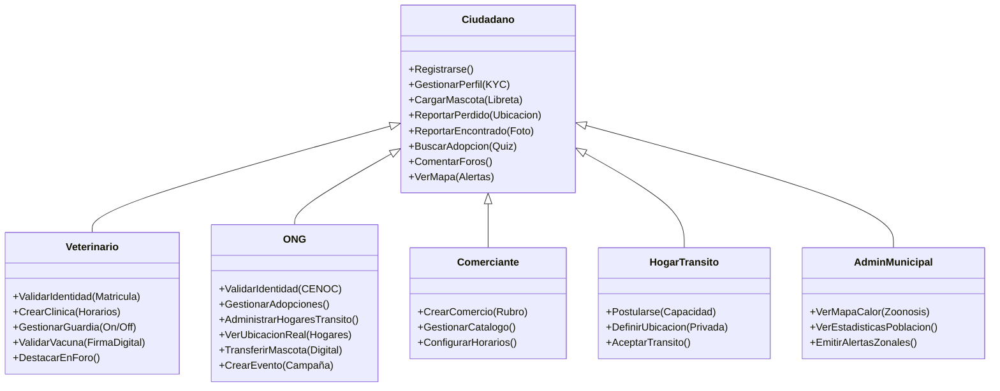

# Diagrama de Roles y Funcionalidades - AnimalConnect 2.0

Este documento visualiza la jerarquía de actores del sistema y las funcionalidades específicas habilitadas para cada perfil, basado en la arquitectura **Bio-Tech Humanista**.

## Modelo de Roles (Jerarquía)

El sistema utiliza un modelo de **Herencia de Roles**. Todos los usuarios autenticados son "Ciudadanos" y pueden acceder a las funciones base. Los roles profesionales (Veterinario, ONG, Comercio) extienden estas capacidades.

## Detalle de Funcionalidades por Perfil

### 👤 Ciudadano (Usuario Base)
Es el rol por defecto al registrarse.
*   **Gestión de Mascotas**: Alta de perfil de mascota, carga de libreta sanitaria, reporte de extravío (Cartel QR).
*   **Interacción**: Reportar avistamientos, comentar en foros, chatear con otros usuarios.
*   **Adopción**: Realizar Test de Compatibilidad y contactar dueños.

### 🩺 Veterinario
Profesional validado mediante matrícula.
*   **Gestión Clínica**: Dar de alta su consultorio y aparecer en el mapa.
*   **Guardias**: Activar/Desactivar estado de "Guardia Activa" en tiempo real.
*   **Autoridad**: Sus comentarios en foros de salud aparecen destacados. Puede validar vacunas cargadas por usuarios.

### 🏢 Comerciante
Dueño de PetShop, Peluquería, etc.
*   **Presencia Comercial**: Perfil de negocio con logo, dirección y horarios.
*   **Visibilidad**: Aparece en el mapa de servicios filtrable por rubro.

### 🐾 ONG / Rescatista
Organización validada (CENOC).
*   **Gestión de Casos**: Panel avanzado para manejar múltiples animales en adopción.
*   **Red de Tránsitos**: Único rol con permiso para ver la **dirección real/exacta** de los Hogares de Tránsito para coordinar logística.
*   **Eventos**: Publicación de campañas de castración/vacunación en el calendario oficial.

### 🏠 Hogar de Tránsito
Usuario voluntario que ofrece su casa temporalmente.
*   **Privacidad**: Su ubicación exacta es **privada** para el público general (Geo-Fuzzing), solo visible para ONGs verificadas.
*   **Capacidad**: Define qué tipo de animales acepta (Perros/Gatos, Grandes/Chicos).
